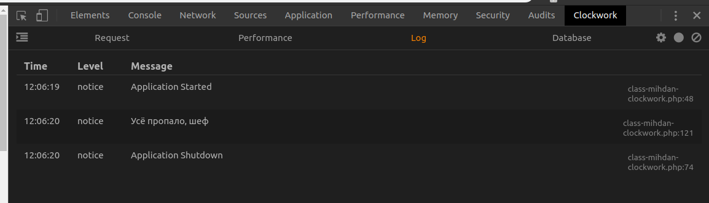

# Mihdan: Clockwork

Отладка WordPress при помощи [Clockwork](https://underground.works/clockwork/)

## Как использовать
1. Ставите расширение Clockwork под [Chrome](https://chrome.google.com/webstore/detail/clockwork/dmggabnehkmmfmdffgajcflpdjlnoemp) или [Firefox]().
2. Ставите плагин **Mihdan: Clockwork**
3. Открываете в панели Dev-Tools вкладку Clockwork
4. В вашей теме пишем `mihdan_clockwork()->notice( 'Усё пропало, шеф!' )`
5. Результат наблюдаем в консоли браузера

